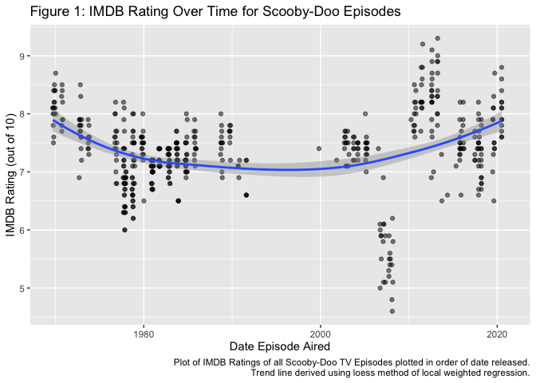
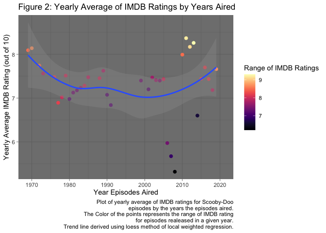
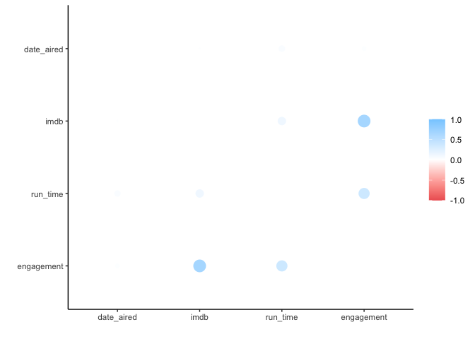
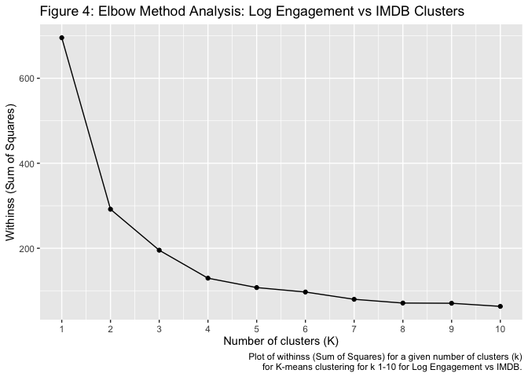
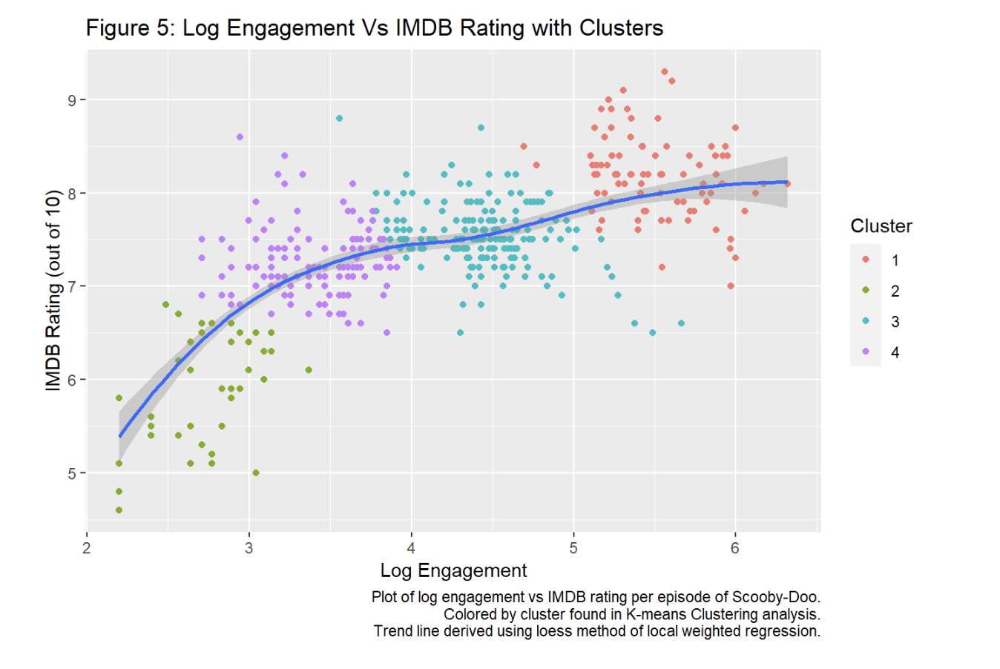

Final Project BAE 495: Scooby-Doo
================
Brian Tierney
12/1/2021

# Introduction and Background

In the modern world entertainment is one of the biggest pieces of
peoples lives. It is also a large piece of peoples upbringing and can
often envoke nostalgia. As a child I used to watch many cartoons on TV
and DVDs, one of my favorites being Scooby-Doo. Like a number of other
classic series Scooby-Doo has been remade for modern audiences several
times. Scooby-Doo first premiered in 1969 and ran all the way into the
mid 1980’s. After that Scooby-Doo was remade several times with
different TV series, specials, and movies. Several of these remakes saw
commercial and critical success and grew the fanbase of the show through
multiple generations of audience. The show and its related intellectual
property is even still being remade today with series airing on Cartoon
Network, Boomerang, and HBO Max. With several other classic cartoon
series following similar patterns I wondered if these cartoons are “as
good as they used to be”? On top of that I wanted to know what data
could predict a high ratings on episodes on a show like Scooby-Doo. In
this report I will attempt to analytically answer both of these
questions by looking at the data about all the versions of Scooby-Doo
from throughout the years.

------------------------------------------------------------------------

# About the Data

This
[dataset](https://github.com/rfordatascience/tidytuesday/blob/master/data/2021/2021-07-13/readme.md)
is from the Tidy Tuesday github, provided to them from Kaggle. This
dataset has 603 Observations of 75 variables that are all different
metrics and tallies from Scooby-Doo media. For my analysis today I will
look at 5 of these variables. I filtered these variables to only have
the formats “TV Show” and “TV Show (segmented)” because I wanted to look
specifically at the TV runs of Scooby-Doo. The columns I analyzed in
this report were:

- **Date Aired**: The date the show, special or movie aired.
- **IMDB Rating**: The rating of the media on IMDB.
- **Engagement**: The viewer engagement metric of the media (higher is
  better).
- **Run-Time**: The run-time of the media in minutes.
- **Format**: The format the media was produced in.

Below (In the next section in **Table 1** and **Table 2**) I will show
the first five lines of the data set and a summary of the data set after
I filter the data.

------------------------------------------------------------------------

# Methodology, Analysis and Results

## Getting and tidying the data

The first thing I did was get all the libraries I would need to complete
my analysis.

``` r
library(tidyverse)
library(lubridate)
library(viridis)
library(corrr)
library(tidymodels)
library(knitr)
```

Next I downloaded the raw data from the Tidy Tuesday github. Then I
turned the data into a data frame to make it easier to work with.

``` r
scoobydoo <- readr::read_csv('https://raw.githubusercontent.com/rfordatascience/tidytuesday/master/data/2021/2021-07-13/scoobydoo.csv')

scoobydoo <- data.frame(scoobydoo)
```

After that I began to tidy the data. Although this data actually came
very nicely formatted there was still a few things I needed to do before
I could begin analyzing. First I needed to select the only columns I was
interested in: *date_aired, imdb, engagement, run_time, and format*.
Next I filtered the data by format to get only the entries I was
interested in: I filtered for the formats *‘TV Series’ and ‘TV Series
(segmented)’*. Then I converted engagement and run_time to a numeric
values as they both came in char form. Lastly I did a log transform on
engagement because the data had a large rand and followed a more
exponential distribution and I wanted to make the data more linear.

``` r
scoobydoo <- scoobydoo %>% select(date_aired, imdb, engagement, run_time, format) %>% filter(format == 'TV Series' | format == 'TV Series (segmented)') %>%
  mutate(imdb = as.numeric(imdb), engagement = as.numeric(engagement)) %>% mutate(engagement = log(engagement))
```

Below in **Table 1** and **Table 2** are the first five lines of the
data set and a summary of the data set after tidying, fixing, and
transforming.

``` r
head(scoobydoo) %>% kable(col.names = c('Date Aired','IMDB Rating (out of 10)','Engagement','Run-Time (minutes)','Format'), align = 'ccccc', caption = 'Table 1: First 5 lines of tidyed and mutated Scooby-Doo Data' )
```

| Date Aired | IMDB Rating (out of 10) | Engagement | Run-Time (minutes) |  Format   |
|:----------:|:-----------------------:|:----------:|:------------------:|:---------:|
| 1969-09-13 |           8.1           |  6.320768  |         21         | TV Series |
| 1969-09-20 |           8.1           |  6.171701  |         22         | TV Series |
| 1969-09-27 |           8.0           |  6.120297  |         21         | TV Series |
| 1969-10-04 |           7.8           |  6.054439  |         21         | TV Series |
| 1969-10-11 |           7.5           |  5.968708  |         21         | TV Series |
| 1969-10-18 |           8.4           |  5.950643  |         21         | TV Series |

Table 1: First 5 lines of tidyed and mutated Scooby-Doo Data

``` r
summary(scoobydoo) %>% kable(col.names = c('Date Aired','IMDB Rating (out of 10)','Engagement','Run-Time (minutes)','Format'), align = 'ccccc', caption = 'Table 2: Summary of Scooby-Doo Dataof tidyed and mutated Scooby-Doo Data' )
```

|     |     Date Aired     | IMDB Rating (out of 10) |  Engagement   | Run-Time (minutes) |      Format      |
|:----|:------------------:|:-----------------------:|:-------------:|:------------------:|:----------------:|
|     |  Min. :1969-09-13  |       Min. :4.600       |  Min. :2.197  |    Min. : 4.00     |    Length:549    |
|     | 1st Qu.:1979-09-22 |      1st Qu.:7.100      | 1st Qu.:3.258 |   1st Qu.:12.00    | Class :character |
|     | Median :1984-10-20 |      Median :7.400      | Median :3.850 |   Median :22.00    | Mode :character  |
|     |  Mean :1993-06-26  |       Mean :7.349       |  Mean :4.007  |    Mean :19.11     |        NA        |
|     | 3rd Qu.:2011-05-17 |      3rd Qu.:7.700      | 3rd Qu.:4.615 |   3rd Qu.:23.00    |        NA        |
|     |  Max. :2021-02-25  |       Max. :9.300       |  Max. :6.321  |    Max. :44.00     |        NA        |
|     |         NA         |        NA’s :15         |   NA’s :15    |         NA         |        NA        |

Table 2: Summary of Scooby-Doo Dataof tidyed and mutated Scooby-Doo Data

------------------------------------------------------------------------

## Part 1: Is Scooby-Doo as good as it used to be?

### Basic Analysis

For **Figure 1** I simply created a graph of the IMDB rating of each
Scooby-Doo episode over time. I added a trend line derived using the
loess method to show the nonlinear relationship trend of episode rating
over time. The trend line is derived using loess method of local
weighted regression to show the non linear relationship between time and
IMDB rating.

``` r
scoobydoo %>% ggplot(aes(x=date_aired, y=imdb)) + 
  geom_point(alpha = .5) +
  geom_smooth(method = loess) +
  labs(title = 'Figure 1: IMDB Rating Over Time for Scooby-Doo Episodes', caption = 'Plot of IMDB Ratings of all Scooby-Doo TV Episodes plotted in order of date released.\nTrend line derived using loess method of local weighted regression.') +
  ylab('IMDB Rating (out of 10)') +
  xlab('Date Episode Aired')
```

<!-- -->

### Average and Range Analysis

For **Figure 2** I wanted to take a deeper dive into the quality of the
show so I decided to make a summary table to better grasp the average
performance of the show by year as well as the range in episode
performance by year. To do this I first took the data and made a new
column called *year_aired* which took the year aired from the
*date_aired* column. I then grouped by the year aired and proceeded to
create a summary table. I had to do the summarize operation twice for it
work correctly (only have 1 Average and Range per year) for reasons
unknown to me. The summary table contains 3 columns:

- **Year Aired**: The year a group of episodes aired.
- **Yearly Average**: The Average of all IMDB ratings from episodes from
  a given year.
- **IMDB Range**: The range of all IMDB ratings from episodes from a
  given year.

``` r
scoobydooRangeAvg <- scoobydoo %>% mutate(year_aired = year(date_aired)) %>% group_by(year_aired) %>% summarize(imdbRange = range(imdb) , year_average = mean(imdb)) %>% summarize(imdbRange = max(imdbRange) , year_average = mean(year_average)) 
```

Below in **Table 3** I show the top 5 results from the summary table by
yearly average.

``` r
scoobydooRangeAvg %>% top_n( n = 5) %>% arrange(-year_average) %>% kable(col.names = c('Year Aired','Yearly IMDB Rating Range', 'Yearly Average IMDB Rating'),align = 'ccc', caption = 'Table 3: Top 5 Results from the summary table of Scooby-Doo Episodes by yearly average IMDB rating')
```

| Year Aired | Yearly IMDB Rating Range | Yearly Average IMDB Rating |
|:----------:|:------------------------:|:--------------------------:|
|    2011    |           9.2            |          8.369231          |
|    2013    |           9.3            |          8.261539          |
|    2012    |           9.1            |          8.170588          |
|    1970    |           8.7            |          8.140000          |
|    1969    |           8.5            |          8.093333          |

Table 3: Top 5 Results from the summary table of Scooby-Doo Episodes by
yearly average IMDB rating

For **Table 2** I created a plot of the yearly averages over time over
time. I colored the points by the yearly range to show the range of each
year with the yearly average The trend line is derived using loess
method of local weighted regression to show non linear relationship of
the shows yearly average rating over time.

``` r
scoobydooRangeAvg %>% ggplot(aes(x=year_aired, y=year_average)) + 
  geom_point(aes(color = imdbRange), size = 2) +
  geom_smooth(method = loess) +
  scale_color_viridis(discrete = FALSE, option = 'A') + 
  theme_dark() +
  labs(title = 'Figure 2: Yearly Average of IMDB Ratings by Years Aired', caption = 'Plot of yearly average of IMDB ratings for Scooby-Doo\nepisodes by the years the episodes aired.\nThe Color of the points represents the range of IMDB rating\nfor episodes realeased in a given year.\nTrend line derived using loess method of local weighted regression.', color = 'Range of IMDB Ratings') +
  ylab('Yearly Average IMDB Rating (out of 10)') +
  xlab('Year Episodes Aired')
```

<!-- -->

------------------------------------------------------------------------

## Part 2: What Factor Best Predicts IMDB Rating of an episode?

### What Factor is the best predictor?

To find out what variable is the best predictor of IMDB rating I decided
to create a correlation plot. To do this I first had to fix the data a
little bit by making the date aired into a numerical value, and
selecting all columns but the format column. I then just put the data
into the corrr corelation function to generate a correlation matrix.

``` r
scobbyDooCorMat <- scoobydoo %>% mutate(date_aired = as.numeric(date_aired)) %>% select(date_aired, imdb, run_time, engagement) %>% corrr::correlate()
```

Below in **Table 4** the correlation matrix in table form.

``` r
scobbyDooCorMat %>% kable(col.names = c('Term','Date Aired','IMDB Rating','Run Time', 'Engagement'),align = 'ccccc', caption = 'Table 4: Correlation Matrix of selected factors from dataset')
```

|    Term    | Date Aired | IMDB Rating | Run Time  | Engagement |
|:----------:|:----------:|:-----------:|:---------:|:----------:|
| date_aired |     NA     |  0.1258539  | 0.2066938 | 0.1501844  |
|    imdb    | 0.1258539  |     NA      | 0.3048366 | 0.6720614  |
|  run_time  | 0.2066938  |  0.3048366  |    NA     | 0.5148573  |
| engagement | 0.1501844  |  0.6720614  | 0.5148573 |     NA     |

Table 4: Correlation Matrix of selected factors from dataset

Below in **Figure 3** (directly below) the correlation matrix in
graphical plot form.

``` r
scobbyDooCorMat %>% rplot() 
```

<!-- -->

### Visualization and Statistical Analysis Of Engagement vs IMDB Rating

In the correlation matrix from **Table 4** and **Figure 3** I saw that
the engagement variable had the best correlation with the IMDB rating.
So i decided to perform statistical analysis on this combination of
variables using k means clustering.

**What is K-means Clustering? and Why use it here?** K-means clustering
is a unsupervised machine learning algorithm which attempts to create
some number k clusters of data points. What that means is that this
algorithm takes unlabeled data points and attempts to group them by
finding k centers and grouping the points around those centers. It first
creates centers and groups randomly. Then it iterates many times using
euclidean distance to points in a cost function to identify optimal
points for centers throughout iterations. Eventually after many
iterations, you end up with k optimized clusters for your data points. I
am using K means clustering here to better understand the relationship
between log engagement and the IMDBN rating of episodes by understanding
how certain levels of engagement yield varying levels of IMDB rating.

**What number k should be used?** To find the optimal k for this
situation I am going to use the elbow method of analysis. For this
method I first do K-means clustering on all k’s from values 1-10. I then
take all my k means clusters and I use the glance function to extract
the important summary information about the results of K-means for all
k’s. Then I unnest those glanced summaries so they become columns on the
table. I then create **Figure 4** plot of withinss (the sum of squares
of the k groups points euclidean distance to the optimized centers of
resultant clusters) vs number of clusters (k) and look for where the
graphs bends at (“the elbow”) and select the value at the end of the
bend. In this case this “elbow” is at k=4.

``` r
scoobydooReduced <- scoobydoo %>% select(engagement, imdb) %>% na.omit()
clusters <- tibble(k= 1:10) %>% mutate(kclusters = map(k, ~kmeans(scoobydooReduced, .x)), glance = map(kclusters, glance)) %>%
  unnest(cols = c(glance))


ggplot(clusters, aes(k, tot.withinss)) +
  geom_line() +
  geom_point() +
  scale_x_continuous(breaks = c(1:10)) + 
  labs(title = 'Figure 4: Elbow Method Analysis: Log Engagement vs IMDB Clusters', caption = 'Plot of withinss (Sum of Squares) for a given number of clusters (k)\nfor K-means clustering for k 1-10 for Log Engagement vs IMDB.') +
  ylab('Withinss (Sum of Squares)') +
  xlab('Number of clusters (K)')
```

<!-- -->

In this case I choose to do K-means clustering with 4 centers based on
the elbow method analysis seen in **Figure 4** (above). Below in **Table
5** is a summary of the K-means clustering results.

``` r
scoobydooClusters<- kmeans(scoobydooReduced, 4)
summary(scoobydooClusters) %>% kable(align = 'cccc', caption = "Table 5: Summary of K-means clustering with 4 centers on Engagement vs IMDB Rating")
```

|              | Length | Class  |  Mode   |
|:-------------|:------:|:------:|:-------:|
| cluster      |  534   | -none- | numeric |
| centers      |   8    | -none- | numeric |
| totss        |   1    | -none- | numeric |
| withinss     |   4    | -none- | numeric |
| tot.withinss |   1    | -none- | numeric |
| betweenss    |   1    | -none- | numeric |
| size         |   4    | -none- | numeric |
| iter         |   1    | -none- | numeric |
| ifault       |   1    | -none- | numeric |

Table 5: Summary of K-means clustering with 4 centers on Engagement vs
IMDB Rating

Next I wanted to visualize these results in a plot. In **Figure 5** I
plot IMDB rating vs Log Engagement. I color the points by the cluster
number they were grouped into by K-means clustering. I use a trend line
derived using loess method of local weighted regression to show the
nonlinear relationship of log engagement Vs IMDB rating.

``` r
scoobydooKmeans <- augment(scoobydooClusters, scoobydooReduced)
scoobydooKmeans %>% ggplot(aes(x= engagement, y = imdb)) +
  geom_point(aes(color = .cluster)) + 
  geom_smooth(method= loess) + 
  labs(title = 'Figure 5: Log Engagement Vs IMDB Rating with Clusters', caption = 'Plot of log engagement vs IMDB rating per episode of Scooby-Doo.\nColored by cluster found in K-means Clustering analysis.\nTrend line derived using loess method of local weighted regression.', color = 'Cluster') +
  ylab('IMDB Rating (out of 10)') +
  xlab('Log Engagement')
```

<!-- -->

------------------------------------------------------------------------

# Discussion

In my analysis I use IMDB rating as a metric of quality for all my
analysis as its the critics and audience rating of the show.

## Did Scooby-Doo Get Worse Over Time?

According to my analysis: absolutely not! It appears that Scooby-Doo did
have a small decline in average quality between 1980 and 2000 (shown in
**Figure 1** and **Figure 2**) but even then the average IMDB rating
stays around a 7 out of 10 for most of that time. After that time
Scooby-Doo has risen rough back to its original quality, 2011-2013 even
over taking the original show with the top 3 Average IMDB ratings per
year (as seen in **Table 3**). There are some bad outlier years in that
rise, namely the couple of years before 2010 (as seen in **Figure 2**),
but the years after that speak for themselves with their drastic
improvement.

Additionally one thing to note is that the highest average years of the
show tended to also have extremely high ranges (as shown in **Table 3**)
meaning even in the best years of the show the show never had perfectly
consistent quality. However in many of the shows mediocre years had
lower ranges (as shown in **Figure 2**) which indicates that although
the average episode was worse in these years the quality of the episodes
may have been more consistent.

## What Factors predict a High IMDB Rating?

### Correlation Analysis

Using a correlation matrix (**Table 4** and **Figure 3**) its easy to
see that out of the factors I looked at the Log Engagement is clearly
the best predictor of IMDB Rating. Looking at the plot **Figure 5** as
well as just look at the correlation coefficient of .672 (found in
**Table 4**) we can see the relationship isn’t that perfect or linear.
Even after a log transform the relationship shown in the trend line in
**Figure 5** is still similar to a log curve In that there’s a lot of
gains in IMDB rating the beginning, then it really levels out and we see
diminishing returns after a log engagement of about a 3.5.

### K-means Clustering Analysis

To further break down the relationship I used K-means clustering to
analyse the relationship and analyze the points with clusters. I used a
k of 4 because that was found using the elbow method as shown in
**Figure 4** (where the “elbow” clearly bends at k = 4). In **Figure 5**
we see four clusters which describe the data. I will go through these
clusters from left to right because the exact numbering and order of the
clusters changes on rerunning/rerendering the report but the cluster
shape and meaning stay the same (when viewed from left to right). The
first cluster from left to right is the points that have the lowest IMDB
rating and the lowest engagement but show large gains in IMDB rating as
engagement level rises, they are the bottom of the curve rising up. The
second cluster from left to right is where the curve continues showing
IMDB rating increasing with engagement but it peaks and flattens. The
third cluster from left to right is where the curve generally flattens
out with some small gains towards the higher engagement values of the
cluster but generally showing diminishing returns. The fourth and final
cluster from left to right is the very top of the curve. In this cluster
of points seemingly passes the flat top of the curve and begins to see
real gains again with the highest IMDB ratings and engagement.

------------------------------------------------------------------------

# Conclusion

In conclusion, I analysed the Scooby-Doo data to find out if the show
got worse over time and what metrics drove the shows success. The show
ended up not getting worse over time but did see a dip in quality
followed by a strong rise in quality after resulting the 3 best years of
the show being in the later years of the data set. The metric that best
predicted higher IMDB ratings was Log Engagement. This has the highest
correlation coefficient (as shown in **Table 4** and **Figure 3**) but
the relationship wasn’t perfect or linear. I did K-means clustering
(using k = 4 clusters as found using the elbow method in **Figure 4**)
to find groups of points which even better show the relationships
between different engagement levels and IMDB rating in **Figure 5**.
